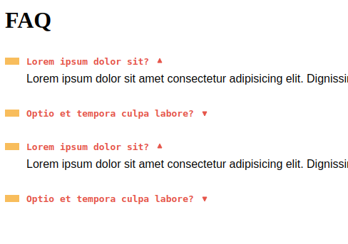

# Accordion

Um Accordion feito com CSS/JavaScript puro, sendo reutilizável através de classes(ES6).

## Exemplo de Utilização

- Baixe os assets presentes na pasta **./dist**.
- Inclua junto os assets em uma pasta de sua preferência

**IMPORTANTE**

Para garantir que os dados do accordion sejam exibidos até mesmo
caso o JavaScript esteja desabilitado, o CSS do accordion
verifica pela existência da classe **.js** antes de esconder
elementos.

Para garantir o bom funcionamento do Accordion, é necessário
detectar a presença do JavaScript, esta verificação existe
no arquivo de exemplo:**./exemplo.html**, na **tag** script
no cabeçalho.

**Imagem:**



**Código:**

```html
<dl class="faq-lista" data-anime="accordion">
  <dt>Lorem ipsum dolor sit?</dt>
  <dd>
    Lorem ipsum dolor sit amet consectetur adipisicing elit. Dignissimos eaque voluptatibus
    quibusdam dicta pariatur recusandae corporis odit ipsum expedita consequatur, iste cumque
    accusamus inventore ducimus itaque, eligendi ipsa! Nemo, impedit.
  </dd>
  <dt>Optio et tempora culpa labore?</dt>
  <dd>
    Lorem ipsum dolor sit amet consectetur adipisicing elit. Dignissimos eaque voluptatibus
    quibusdam dicta pariatur recusandae corporis odit ipsum expedita consequatur, iste cumque
    accusamus inventore ducimus itaque, eligendi ipsa! Nemo, impedit.
  </dd>
  <dt>Lorem ipsum dolor sit?</dt>
  <dd>
    Lorem ipsum dolor sit amet consectetur adipisicing elit. Dignissimos eaque voluptatibus
    quibusdam dicta pariatur recusandae corporis odit ipsum expedita consequatur, iste cumque
    accusamus inventore ducimus itaque, eligendi ipsa! Nemo, impedit.
  </dd>
  <dt>Optio et tempora culpa labore?</dt>
  <dd>
    Lorem ipsum dolor sit amet consectetur adipisicing elit. Dignissimos eaque voluptatibus
    quibusdam dicta pariatur recusandae corporis odit ipsum expedita consequatur, iste cumque
    accusamus inventore ducimus itaque, eligendi ipsa! Nemo, impedit.
  </dd>
</dl>
<script>
  // Primeiro parâmetro: Elementos que disparam o toggle do Accordion
  const accordion = new Accordion('[data-anime="accordion"] dt');
  accordion.init();
</script>
```

## Testar Utilização

Para testar a utilização: É possível através do arquivo **./exemplo.html**

Para desenvolver: Utilize o arquivo **./index.html**

## Estilização

Para melhor capacidade de estilização, o CSS não está minificado, permitindo
ser customizado com facilidade.

Para modificar o estilo do Accordion, edite o estilo na pasta **./dist**

## Funcionamento

O Accordion possui somente o estilo básico para seu funcionamento,
demais estilos devem ser feitos de acordo com a necessidade.
